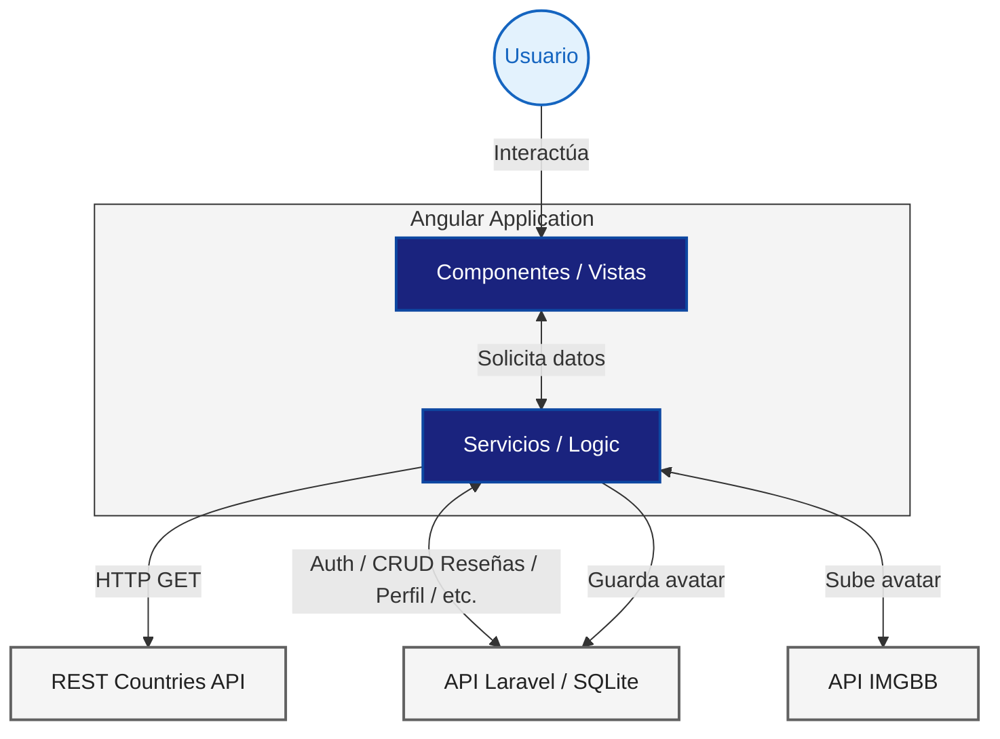

# Arquitectura del proyecto - WIP

<p align="right"><a href="../README.md">Volver al README general</a></p>

<a id="readme-top"></a>

<!-- TABLE OF CONTENTS -->
<details>
  <summary>Tabla de Contenidos</summary>
  <ol>
    <li><a href="#general">Visión General</a></li>
    <li><a href="#tech-stack">Stack Tecnológico</a></li>
    <li><a href="#project-structure">Estructura de Carpetas</a></li>
    <li><a href="#api-integrations">Integraciones con APIs</a></li>
    <li><a href="#navigation">Navegación</a></li>
    <li>
      <a href="#general">Consideraciones y decisiones</a>
      <ul>
        <li><a href="#performance">Rendimiento</a></li>
        <li><a href="#seo">SEO</a></li>
      </ul>
    </li>
  </ol>
</details>

<!-- Overview -->

## 1. Visión General

<p align="justify">LosPaises es un proyecto de desarrollo web en el que busco aprender y asimilar conocimientos de desarrollo Front-end. Y más en concreto, el uso del framework Angular, con el objetivo de aprender a construir aplicaciones modernas de manera profesional. Me propusieron hacer un proyecto Angular en 2 semanas que demostrara el domino de los pilares del framework: componentes, servicios, rutas, etc.

He elegido desarrollar una aplicación que consuma la API <a href="https://restcountries.com/">REST Countries</a>, de datos de países, que permita a los usuarios visualizar una lista de países, elegir uno de ellos y dejar una reseña con valoración de 1 a 5 estrellas.

Para agregar gestión de usuarios, permisos, perfil de usuario y guardar los comentarios y valoraciones, he integrado el proyecto con una API propia.

</p>



<p align="right">(<a href="#readme-top">back to top</a>)</p>

<!-- Stack Tecnológico -->

<a id="tech-stack"></a>

## 2. Stack Tecnológico

Las tecnologías que usado para desarrollar el proyecto son:

- [](#) [Angular 21](https://angular.dev/overview)
  - [Modulo A11y (accesibilidad) - Angular Material CDK ](https://material.angular.dev/cdk/a11y/overview)
  - [Librería RxJS (peticiones http asíncronas)](https://rxjs.dev/guide/overview)
  - [LucideAngularModule (iconos)](https://lucide.dev/guide/packages/lucide-angular)
- [](#) [HTML5](https://www.w3schools.com/html/html_intro.asp)
- [](#) [CSS3](https://lenguajecss.com/)
- [](#) [TypeScript](https://www.typescriptlang.org/docs/)

<p align="right">(<a href="#readme-top">back to top</a>)</p>

<!-- Estructura de Carpetas -->

<a id="project-structure"></a>

## 3. Estructura de Carpetas

```text
.
├── docs/ - Documentación técnica
├── public/ - Archivos públicos estáticos
│   └── assets/ - Recursos (imágenes, logos, etc.)
├── src
│   ├── app
│   │   ├── core/ - Lógica central y reutilizable de la App
│   │   │   ├── guards
│   │   │   ├── interceptors
│   │   │   ├── models
│   │   │   ├── pipes
│   │   │   └── services
│   │   ├── environments/ - Configuraciones de entorno
│   │   ├── pages/ - Páginas o vistas (algunas contienen componentes anidados)
│   │   │   ├── countries
│   │   │   ├── country-detail
│   │   │   ├── landing
│   │   │   ├── profile
│   │   │   ├── sign-in
│   │   │   └── sign-up
│   │   └── shared/ - Componentes(UI) y utiles globales
│   │       ├── components
│   │       └── utils
```

<p align="right">(<a href="#readme-top">back to top</a>)</p>

<!-- Integraciones con APIs -->

<a id="api-integrations"></a>

## 4. Integraciones con APIs

### 4.1. REST Countries API

La aplicación consume la API de <a href="https://restcountries.com/">**REST Countries**</a> para obtener datos de todos los países del mundo, tales como su nombre, capital, población, imagen de su bandera, etc.

#### Servicio implementado para integrar: `CountryService`

```typescript
@Injectable({
  providedIn: 'root',
})
export class CountryService {
  private http = inject(HttpClient);
  private readonly apiUrl: string = 'https://restcountries.com/v3.1';

  // Obtiene un país por su código cca3 (ej.: "ESP")
  getByCode(code: string): Observable<Country> {
    return this.http.get<Country>(
      `${this.apiUrl}/alpha/${code}?fields=cca3,capital,region,population,flags,translations,maps,name`,
    );
  }

  // Obtiene todos los países
  getAll(): Observable<Country[]> {
    return this.http.get<Country[]>(`${this.apiUrl}/all?fields=cca3,region,flags,translations`);
  }
}
```

#### Detalles de la implementación:

- **Filtrado de campos:** Usa el parámetro `?fields=` en las URLs para pedir solo los datos que realmente necesita (como la bandera, población o traducciones).
- **Modelado de datos:** Los resultados se mapean automáticamente a la interface `Country`.

<p align="right">(<a href="#readme-top">back to top</a>)</p>

### 4.2. Los Paises API (API propia)

Para gestionar todos los datos de la aplicación (usuarios, reseñas y perfiles), he desarrollado una API REST propia utilizando el framework **Laravel**. Y la he desplegado en una instancia EC2 de **AWS (Amazon Web Services)** para que sea accesible desde cualquier lugar.

#### Configuración Base

- **URL Base:** `https://los-paises.publicvm.com/api`
- **Formato de datos:** JSON (es obligatorio enviar la cabecera `Accept: application/json`).
- **Seguridad:** Utiliza **Sanctum** para la autenticación basada en tokens (`Bearer Token`).

#### Endpoints Principales

##### Autenticación y Cuenta

Es la parte encargada de gestionar quién entra en la app. Al hacer login, la API responde con un token que se guarda en el localStorage y se usa en las siguientes peticiones.

| Método     | Endpoint    | Descripción                       | ¿Auth? |
| ---------- | ----------- | --------------------------------- | ------ |
| **POST**   | `/register` | Crea un usuario nuevo.            | No     |
| **POST**   | `/login`    | Entra y recibe el `access_token`. | No     |
| **GET**    | `/user`     | Trae datos de usuario.            | **Sí** |
| **DELETE** | `/user`     | Elimina cuenta definitivamente.   | **Sí** |

##### Reseñas (Reviews)

Estos endpoints permiten que los usuarios posteen sus reseñas de los países. Se pueden filtrar por país usando el codigo cca3 (ej: `ESP`).

| Método     | Endpoint        | Descripción                                      | ¿Auth? |
| ---------- | --------------- | ------------------------------------------------ | ------ |
| **GET**    | `/reviews`      | Ver todas las reseñas (puedes filtrar por país). | No     |
| **POST**   | `/reviews`      | Publicar un comentario y puntuación.             | **Sí** |
| **PUT**    | `/reviews/{id}` | Editar una reseña que ya escribí.                | **Sí** |
| **DELETE** | `/reviews/{id}` | Borrar una reseña.                               | **Sí** |

##### Gestión de Perfiles

Permite ver la info pública de otros usuarios o actualizar nuestra propia información (como el nombre o el link del avatar que subimos a ImgBB).

| Método  | Endpoint         | Descripción                      | ¿Auth? |
| ------- | ---------------- | -------------------------------- | ------ |
| **GET** | `/profiles/{id}` | Ver perfil de un usuario.        | No     |
| **PUT** | `/profiles/{id}` | Cambiar nombre o foto de perfil. | **Sí** |

#### Ejemplo de uso (cURL)

Si quisiéramos registrar a un usuario nuevo desde la terminal, se haría así:

```bash
curl -X POST https://los-paises.publicvm.com/api/register \
     -H "Accept: application/json" \
     -H "Content-Type: application/json" \
     -d '{"email": "estudiante@daw.com", "password": "password123", "password_confirmation": "password123"}'

```

<p align="right">(<a href="#readme-top">back to top</a>)</p>

### 4.3. IMGBB API

Para gestionar el cambio de avatar (imagen de perfil) de los usuarios, la aplicación realiza dos pasos: primero sube la imagen a un servidor externo y luego guarda la url haciendo una petición PUT a la API propia (Los Paises API).

#### 1. Subida a ImgBB

Se utiliza la API de <a href="https://imgbb.com/api">**ImgBB**</a> para el almacenamiento de imágenes. ImgBB recibe un `FormData` con el archivo y nos devuelve una URL pública.

```typescript
public uploadAvatar(formData: FormData): Observable<HttpResponse<any>> {
  return this.externalHttp.post(
    `https://api.imgbb.com/1/upload?key=${environment.imgBBapiKey}`,
    formData,
    {
      observe: 'response',
    },
  );
}

```

#### 2. Guardado en "Los Paises API"

Una vez obtenida la URL de la imagen, se hace una petición `PUT` a la API propia para actualizar el perfil del usuario con la nueva url del avatar.

```typescript
public saveAvatarUrl(dataToUpdate: AvatarUrl, id: string): Observable<HttpResponse<ProfileData>> {
  return this.http.put<ProfileData>(environment.apiUrl + `/profiles/${id}`, dataToUpdate, {
    observe: 'response',
  });
}

```

<p align="right">(<a href="#readme-top">back to top</a>)</p>
