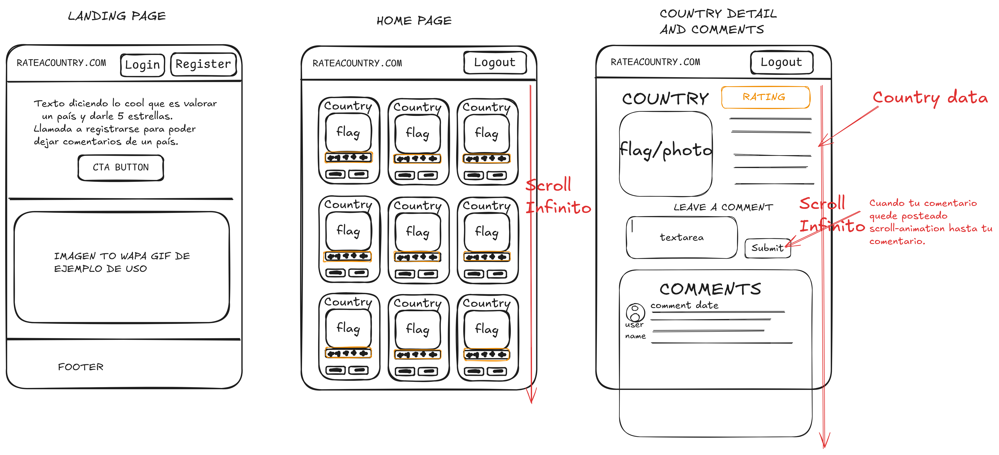

# Sistema de diseño UI - WIP

<a href="../README.md">Volver al README general</a>

<!-- TABLE OF CONTENTS -->

  
Tabla de Contenidos

  <ol>
    <li><a href="#philosophy">Filosofía de Diseño</a></li>
    <li><a href="#core-elements">Elementos Principales de la UI</a></li>
    <li><a href="#ux">Consistencia y Experiencia de usuario</a></li>
    <li><a href="#responsiveness">Responsividad</a></li>

<!-- Bocetos -->

## Bocetos

El diseño UI del proyecto parte de estos bocetos:

<!-- Filosofía -->

## 1. Filosofía de Diseño: "Menos es más"

Para diseñar la interfaz de usuario he seguido la filosofía de "Menos es más". La idea es hacer una aplicación simple que muestre datos de manera limpia, así que he intentado crear un diseño consistente, intuitivo, limpio, suave y con bordes redondeados, que no distraiga al usuario de la lectura de información. Para conseguirlo, definí una serie de variables CSS en los estilos globales de aplicación, en el documento "styles.css".

En este apartado resumo algunos detalles como la paleta de colores o sistema de espaciado.
En otros apartados veremos que también definí algunas clases para establecer el layout general, y asegurar la consistencia del diseño visual y la responsividad.

Puedes ver los estilos globales de la app al completo [aquí](../src/styles.css)

Justo abajo muestro algunas variables que definí a nivel de raíz del proyecto `:root` en `styles.css`:

### Resumen Paleta de Colores

| Rol        | Valor (hex) | Variable CSS   |
| ---------- | ----------- | -------------- |
| Primario   | `#0891b2`   | `--primary`    |
| Secundario | `#22d3ee`   | `--secondary`  |
| Background | `#f8fafc`   | `--background` |
| Superficie | `#ffffff`   | `--surface`    |
| Texto      | `#0f172a`   | `--text-main`  |
| Borde      | `#e2e8f0`   | `--border`     |

### Variables de espaciado (padding, margin, gap, etc.)

| Variable        | Valor             | Uso                 |
| --------------- | ----------------- | ------------------- |
| `--spacing-xs`  | `4px` / `0.25rem` | Gaps pequeños       |
| `--spacing-sm`  | `8px` / `0.5rem`  | Gaps iconos, inline |
| `--spacing-md`  | `16px` / `1rem`   | Padding estándar    |
| `--spacing-lg`  | `24px` / `1.5rem` | Padding de sección  |
| `--spacing-xl`  | `32px` / `2rem`   | Gaps grandes        |
| `--spacing-xxl` | `48px` / `3rem`   | Margenes de sección |

### Sombras suaves y bordes redondeados

Aquí muestro un ejemplo de una sombra y un border-radius definidos:

| Variable      | Valor                           | Uso                    |
| ------------- | ------------------------------- | ---------------------- |
| `--shadow-sm` | `0 1px 2px 0 rgb(0 0 0 / 0.05)` | Sombras pequeñas       |
| `--radius-md` | `12px`                          | Border-radius estándar |

(<a href="#readme-top">back to top</a>)

<!-- Elementos UI core -->

## 2. Elementos Principales de la UI

(<a href="#readme-top">back to top</a>)

<!-- UX -->

## 3. Consistencia y Experiencia de usuario

(<a href="#readme-top">back to top</a>)

<!-- UX -->

## 4. Responsividad

(<a href="#readme-top">back to top</a>)

